Simple English-German Translator for Pebble Time
========

### What is Pebble Time

[Pebble Time](https://www.pebble.com/pebble-time-smartwatch-features?gclid=CjwKEAiA18mzBRCo1e_-y_KLpXISJACEsANGJC6oFXGvAKZnu8FILRKt-vXZgMHSj0mZoWPVi17nIRoC5UHw_wcB)
is a smartwatch developed by [Pebble Technology](https://www.pebble.com/) and manufactured by Foxlink, released on 14 May 2015. This is the first Pebble to introduce a color e-paper display, as well as a __microphone__, a new charging cable and a new Pebble Time-optimized Operating System.

### What does this project do

#### The Aim
The aim of the project is to design and implement a translator software which running on a Pebble Time smartwatch.

It can listen, translate, then show the result on your wrist.

#### Demo

This demo will show how to use this project to translate the sentence, "This is a small house", to German.

* First launch the application on your watch

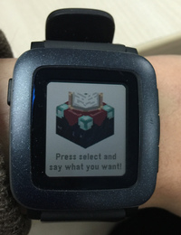
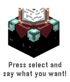

* Press `Select` to enable the dictation

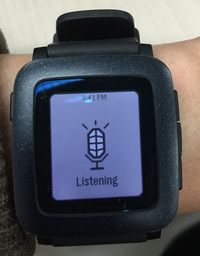
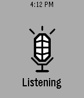

* Say "This is a small house". Then check the result of the dictation.

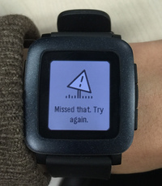
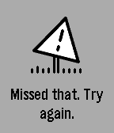

> Ooops! It takes too much time to take a photo.

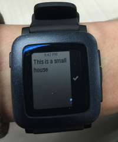
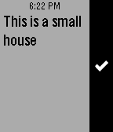

* Wait a second. You will get your answer.

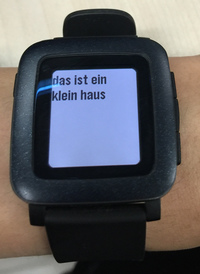
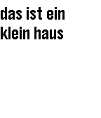

There will be a page to tell you where is the end.

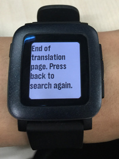
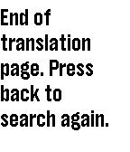

### Project Structure

This project is made of 3 parts.

1. A Pebble Time Application
2. A HTTP server
3. A [MOSES](http://www.statmt.org/moses/) static machine translation system

#### Pebble Time Application

##### Structure

* [main.c](src/main.c)

This file discribes the main UI of the application.

It creates a window, a click provider to handle the `select` button and the mailbox to send message to the application on your phone.

When it recieves the translation from your phone, it will call the function in `translation.{c,h}` to create another window.

* [translation.{c,h}](src/translation.c)

These two files discribe the translation window.
It create a window with many pages to show the translations and a click provider to handle the `up` and `down` button which let you switch between pages.

* [pebble-js-app.js](src/js/pebble-js-app.js)

This file runs on your phone.

It handles the bluetooth commication between your Pebble Time and your phone.
When it recieves a message from your watch, it will send a request to the HTTP server to translate the sentence, then return the result.

#### HTTP server

These 2 files run on a [node.js](https://nodejs.org/en/) enviroment.

##### Structure

* [pebble-translator.js](server/pebble-translator.js)

It just calls `pebble-translator.py`, then return the result.

* [pebble-translator.py](server/pebble-translator.py)

Execute this file to run the MOSES system.

#### MOSES static machine translation system

These files require a MOSES system to run.

##### Structure

* [moses.ini](server/phrase-model/moses.ini)
The configuration of the MOSES system, including the configuration of the mode, the kernel, the phrase table and the weight when training the model.

* [phrase-table{,reverse}](server/phrase-model/phrase-table)
The English-German phrase table in MOSES format.

* [trans-details](server/phrase-model/trans-details)
The details of the translation process.
